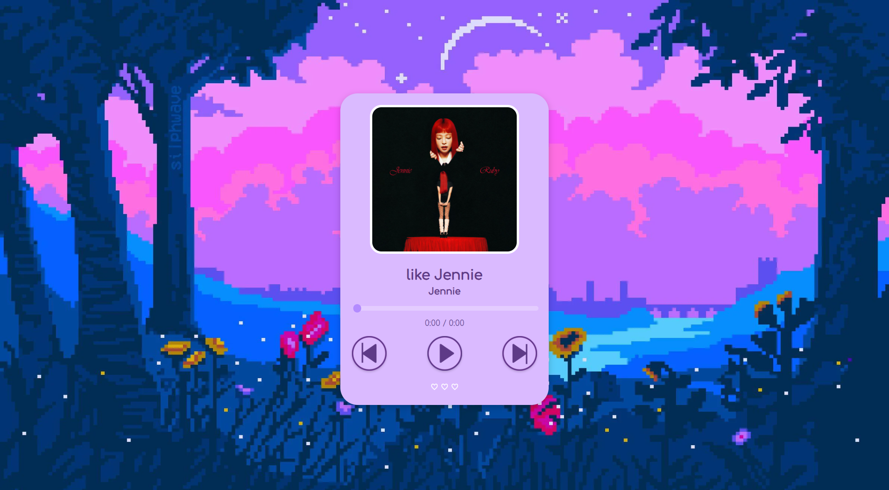

# Retro Music Player

A simple desktop music player built with ElectronJS, HTML, CSS, and JavaScript.  
Pixel-style, lightweight, and made for fun.

---

## Features

- Retro-inspired UI (pixel background, round buttons)
- Custom playlist with cover image and mp3
- Audio player with play / pause / next / prev
- Progress bar with current time and duration
- Works offline after build
- Exportable as `.exe` using Electron

---

## 🖼️ Preview



---

## How to use

```bash
git clone https://github.com/for-everyoung12/music-player-app.git
cd music-player-app
npm install
npm start
```

---

## Build to .exe

```bash
npm run build
```

> Make sure `electron-packager` is installed (already in `devDependencies`)

---

## Notes

- Song files and images are in `assets/songs/` and `assets/covers/`
- You can edit the playlist in `renderer.js` by modifying the `songs[]` array

---

## Author

Created by [@for-everyoung12](https://github.com/for-everyoung12)  
Just a dude who likes music, pixel art, and writing clean UI without bloat.
